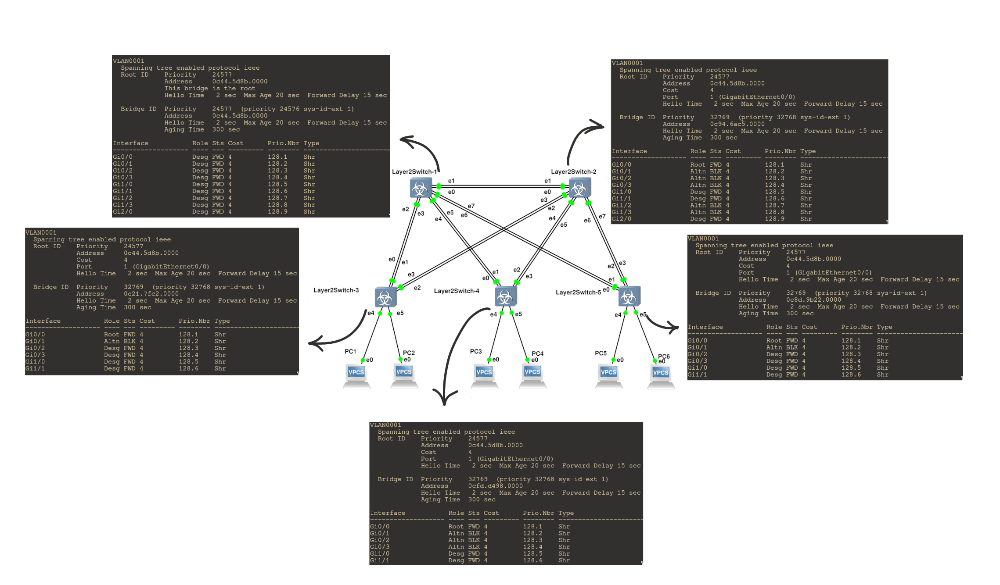
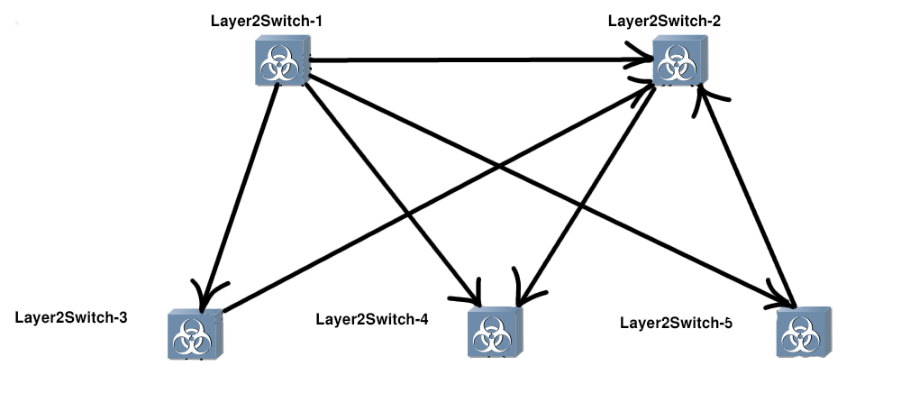
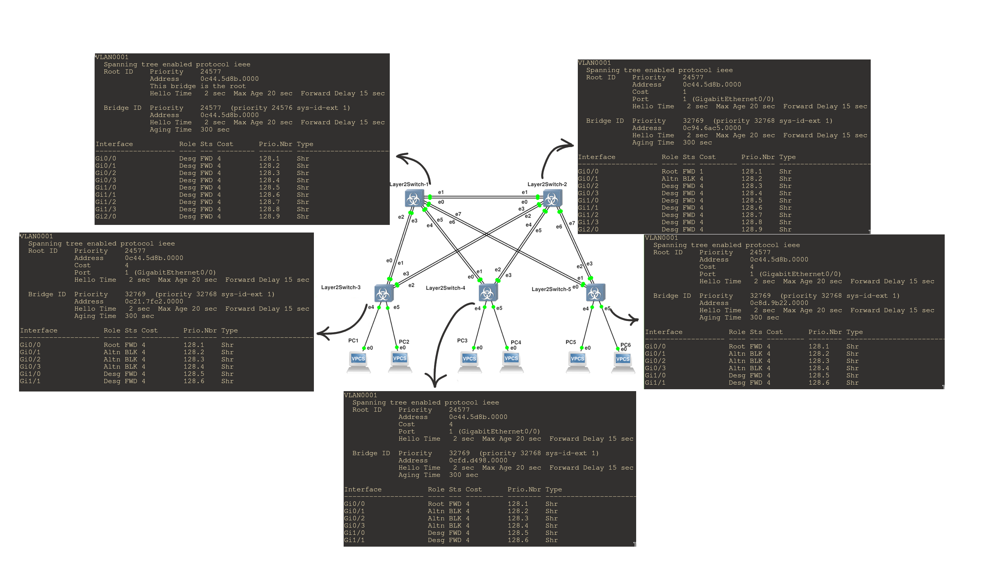

### Тема: Настройка протокола STP (IEEE 802.1D)
---

1) **Для заданной на схеме schema-lab2 сети, состоящей из управляемых коммутаторов и персональных компьютеров настроить протокол STP, назначив явно один из коммутаторов корневым настройкой приоритета**

В лабораторной работе я сдублировал конфигурацию схемы. С помощью команды `show spanning-tree root` выяснил, что корневым коммутатором является *Layer2Switch-3*. Чтобы сделать корневым коммутатор *Layer2Switch-1*, я подключился к нему через консоль и выполнил следующие команды:
- `enable` *(переход в привелигерованный режим)*
- `configure terminal` *(переход в режим глобальной конфигурации)*
- `spanning-tree vlan 1 root primary` *(установка текущего коммутатора корневым за счет уменьшения приоритета)*
- `end` *(выход из режима конфигурации)*
- `write memory` *(сохранение текущей конфигурации в постоянную память)*
- `disable` *(выход из превилигерованного режима)*
---
2) **Проверить доступность каждого с каждым всех персональных компьютеров (VPCS), результаты запротоколировать**

Я настроил IP-адреса 192.168.0.x/24 для каждого VPCS, где x соответствует номеру устройства PCx. Чтобы проверить соединения между всеми VPCS, выполню следующие ping-запросы:
- C PC1 отправлю ping на PC2, PC3, PC4, PC5, PC6.
- C PC2 отправлю ping на PC3, PC4, PC5, PC6.
- C PC3 отправлю ping на PC4, PC5, PC6.
- C PC4 отправлю ping на PC5, PC6.
- C PC5 отправлю ping на PC6.

Полные результаты выполнения всех комманд находятся в файле [ping.md](ping.md)

---
3) **На изображении схемы отметить BID каждого коммутатора и режимы работы портов (RP/DP/blocked) и стоимости маршрутов, результат сохранить в файл**



---
4) **При помощи wireshark отследить передачу пакетов hello от корневого коммутатора на всех линках (nb!), результаты включить в отчет**

Пакеты STP проходят по следующему маршруту:


---
5) **Изменить стоимость маршрута для порта RP произвольного назначенного (designated) коммутатора, повторить действия из п.3, результат сохранить в отдельный файл**

На коммутаторе Layer2Switch-2 я изменил стоимость root-порта на 1, выполнив следующие команды:
```
enable
configure interface
interface Gi0/0
spanning-tree vlan 1 cost 1
end
write memory
disable
```


---
6) **Сохранить файлы конфигураций устройств в виде набора файлов с именами, соответствующими именам устройств**

    [Switch 1](Layer2Switch-1.conf)\
    [Switch 2](Layer2Switch-2.conf)\
    [Switch 3](Layer2Switch-3.conf)\
    [Switch 4](Layer2Switch-4.conf)\
    [Switch 5](Layer2Switch-5.conf)
