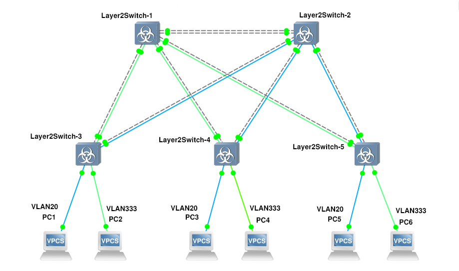
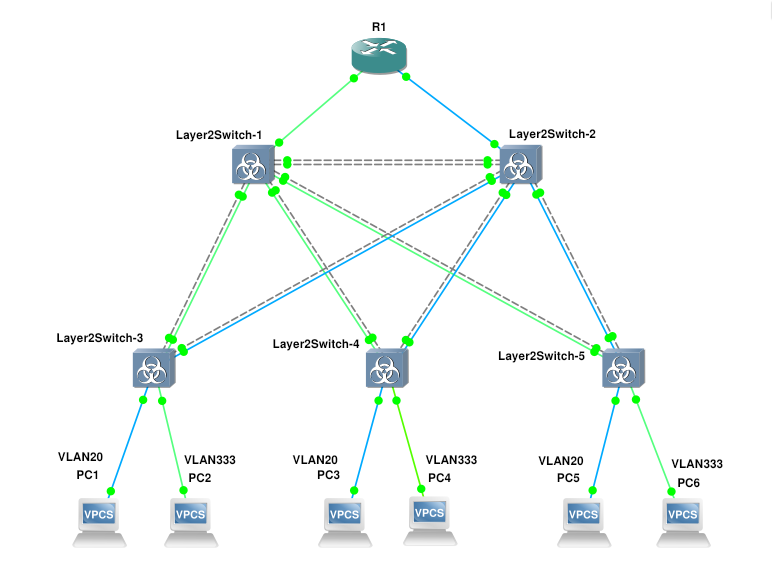

### Тема: Настройка виртуальной локальной сети (VLAN)

1) **Для заданной на схеме schema-lab3 сети, состоящей из управляемых коммутаторов и персональных компьютеров настроить на коммутаторах логическую топологию используя протокол IEEE 802.1Q, для передачи пакетов VLAN333 между коммутаторами использовать Native VLAN**

На системе я настроил следующую логическую топологию:

Синий - VLAN 20 \
Зеленый - VLAN 333 \
Серый пунктир - VLAN 1\
Для того, чтобы настроить коммутаторы я использовал следующие команды:
- `interface <interface_name>` - переход в конфигурацию конкретного интерфейса
- `switchport mode access` - перевод порта в режим доступа (порт работает только в одном VLAN)
- `switchport access vlan <vlan_num>` - назначение порта конкретному VLAN в режиме доступа
- `switchport trunk encapsulation dot1q` - задаёт тип инкапсуляции VLAN для транка
- `switchport mode trunk' - перевод порта в режим транка (порт может передавать трафик нескольких VLAN)
- `switchport trunk allowed vlan <vlan_num>` - указание, какие VLAN разрешены на транковом порте
- `switchport trunk native vlan <vlan_num>` - назначение "native" VLAN для транка

На связях между коммутаторами я установил порты в режим `trunk`, а на портах, которые соединяются с VPCS в режим `access`. Тем связям, которые я не планировал использовать, назначил VLAN 1.\
Компьютерам были назначены следующие адреса:
#### VLAN 20:
**PC1** - 10.0.20.2/24 10.0.20.1\
**PC3** - 10.0.20.3/24 10.0.20.1\
**PC5** - 10.0.20.4/24 10.0.20.1\
#### VLAN 333:
**PC2** - 10.3.33.2/24 10.3.33.1\
**PC4** - 10.3.33.3/24 10.3.33.1\
**PC6** - 10.3.33.4/24 10.3.33.1

---
2) **Проверить доступность персональных компьютеров, находящихся в одинаковых VLAN и недоступность находящихся в различных, результаты задокументировать**

Результаты тестов находятся в [ping.md](ping.md). Из них видно, что из одной сети в другую попасть нельзя, а внутри одной все работает как ожидалось.

---
3) **Перехватить в WireShark пакеты с тегами и без тегов (nb!), результаты задокументировать**

На связях настроенных на VLAN 20 между коммутаторами можно увидеть кадры Ethernet II, тип которых 0x8100 (**802.1q**). За Ethernet заголовком идет **802.1q** заголовок содержащий приоритет, индикатор допустимости удаления и идентификатор VLAN. Эти кадры являются тегированными. Но при переходе через `access` порты теги снимаются.\
На связях настроенных на VLAN 333 между коммутаторами можно увидеть кадры Ethernet II, тип которых 0x8000 (IPv4). За заголовком Ethernet сразу же идет IP заголовок и нет информации о том, к какой сети он принадлежит, так как на самом коммутаторе порт настроен так, что все пришедшие кадры без 802.1q заголовка нужно обрабатывать как VLAN 333 и отправлять без этих заголовков. Это не тегированные кадры.

---
4) **Сохранить файлы конфигураций устройств в виде набора файлов с именами, соответствующими именам устройств**

    [Switch 1](Layer2Switch-1.conf)\
    [Switch 2](Layer2Switch-2.conf)\
    [Switch 3](Layer2Switch-3.conf)\
    [Switch 4](Layer2Switch-4.conf)\
    [Switch 5](Layer2Switch-5.conf)

---
5) **Опциональное задание: Добавить в схему маршрутизатор, подключенный к коммутаторам Layer2Switch1 и Layer2Switch2, настроить через него маршрутизацию между VLAN**

На маршрутизаторе установил следующие настройки портов:
```
interface FastEthernet0/0
 ip address 10.3.33.1 255.255.255.0
 duplex auto
 speed auto
!
interface FastEthernet1/0
 ip address 10.0.20.1 255.255.255.0
 duplex auto
 speed auto
!
```
И получил вот такую схему:


Теперь при попытке отправить ping из одной сети в другую пакеты доходят.

Вот пример ping-запросов от PC1, находящегося в VLAN 20, к компьютерам, находящимся в VLAN 333:

    PC1> ping 10.3.33.2

    84 bytes from 10.3.33.2 icmp_seq=1 ttl=63 time=17.541 ms
    84 bytes from 10.3.33.2 icmp_seq=2 ttl=63 time=15.202 ms
    84 bytes from 10.3.33.2 icmp_seq=3 ttl=63 time=15.065 ms
    84 bytes from 10.3.33.2 icmp_seq=4 ttl=63 time=18.474 ms
    84 bytes from 10.3.33.2 icmp_seq=5 ttl=63 time=23.536 ms

    PC1> ping 10.3.33.3

    84 bytes from 10.3.33.3 icmp_seq=1 ttl=63 time=21.271 ms
    84 bytes from 10.3.33.3 icmp_seq=2 ttl=63 time=15.122 ms
    84 bytes from 10.3.33.3 icmp_seq=3 ttl=63 time=14.188 ms
    84 bytes from 10.3.33.3 icmp_seq=4 ttl=63 time=14.805 ms
    84 bytes from 10.3.33.3 icmp_seq=5 ttl=63 time=14.674 ms

    PC1> ping 10.3.33.4

    84 bytes from 10.3.33.4 icmp_seq=1 ttl=63 time=19.443 ms
    84 bytes from 10.3.33.4 icmp_seq=2 ttl=63 time=16.633 ms
    84 bytes from 10.3.33.4 icmp_seq=3 ttl=63 time=15.621 ms
    84 bytes from 10.3.33.4 icmp_seq=4 ttl=63 time=13.478 ms
    84 bytes from 10.3.33.4 icmp_seq=5 ttl=63 time=15.202 ms

Причем в Wireshark все так же видно, что на связях, которые относятся к VLAN 20 кадры тегируются, но проходя по связям, относящимся к VLAN 333, они не имеют заголовка 802.1q.