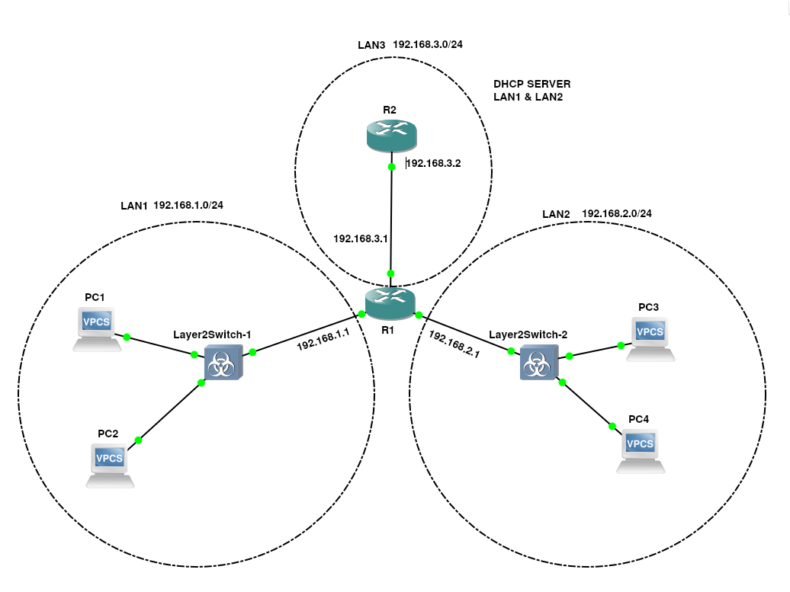

## Тема: Настройка протокола DHCP

1) **Для заданной на схеме schema-lab4 сети, состоящей из управляемых коммутаторов, маршрутизаторов и персональных компьютеров выполнить планирование и документирование адресного пространства в подсетях LAN1, LAN2, LAN3 и назначить статические адреса маршрутизаторам и динамическое конфигурирование адресов для VPC**



LAN1 - 192.168.1.0/24\
LAN2 - 192.168.2.0/24\
LAN3 - 192.168.3.0/24\
Для того, чтобы назначить статические адреса маршрутизаторам внутри подсетей я использовал следующие команды:
```
interface <interface_name>
    ip address 192.168.x.x 255.255.255.255
    ip helper-address 192.168.3.2 (для dhcp relay к R2)
```

Соответственно у первого маршрутизатора получилось три интерфейса с адресами:
- Fa0/0 - 192.168.1.1 - *LAN1*
- Fa1/0 - 192.168.3.1 - *LAN3*
- Fa2/0 - 192.168.2.1 - *LAN2*

А у второго всего один порт с адресом:
- Fa0/0 192.168.3.2 - *LAN3*
---
2) **Настроить сервер DHCP на маршрутизаторе R2 для обслуживания адресных пулов адресного пространства подсетей LAN1 и LAN2**

Для настройки DHCP сервера на R2 я использовал следующие команды:\
Для создания пулов адресов:
```
ip dhcp pool LANx
    network 192.168.x.0 255.255.255.0
    default-router 192.168.x.1
```
Для исключения адресов маршрутизаторов из пулов:
```
ip dhcp excluded-address 192.168.1.1
ip dhcp excluded-address 192.168.2.1
```
---
3) **Настроить статическую (nb!) маршрутизацию между подсетями**

Для настройки статической маршрутизации на R2 я использовал эти команды:
```
ip route 192.168.1.0 255.255.255.0 192.168.3.1
ip route 192.168.2.0 255.255.255.0 192.168.3.1
```
Без этой настройки ответ DHCP сервер не возвращал ответ

---
4) **Проверить работоспособность протокола DHCP и маршрутизации, выполнив ping между всеми VPC**

После запроса всеми компьютерами IP-адреса через dhcp на R2 результат выполнения команды, показывающей распределенные адреса выглядит так:

    R2#sh ip dhcp b
    Bindings from all pools not associated with VRF:
    IP address          Client-ID/		   Lease expiration        Type
            Hardware address/
            User name
    192.168.1.2         0100.5079.6668.01       Mar 02 2002 12:01 AM    Automatic
    192.168.1.3         0100.5079.6668.00       Mar 02 2002 12:00 AM    Automatic
    192.168.2.2         0100.5079.6668.03       Mar 02 2002 12:01 AM    Automatic
    192.168.2.3         0100.5079.6668.02       Mar 02 2002 12:01 AM    Automatic

Результаты выполнения ping-запросов находятся в [ping.md](ping.md)

---
5) **Перехватить в wireshark диалог одного из VPC с сервером DHCP, разобрать с комментариями**

В момент после запуска команды `ip dhcp` на PC3 происходит отправка DHCP Discover пакета. Он является широковещательным и в полях отправителя имеет только MAC-адрес, так как IP-адреса у него еще нет. Проходя через коммутатор фрейм никак не изменяется, так как на нем не настроено тегирование пакетов. После прохождения R1 кадр изменяется и в поле отправителя задается адрес R1 и сам пакет DHCP изменяет запись о DHCP relay agent адресе.

R2 отвечает на это пакетом DHCP Offer в котором отправляет предлагаемый IP-адрес, маску сети, шлюз, срок аренды. Дальше при переходе через маршрутизатор R1 кадр получает в поле получателя адрес PC3 и в IP-заголовке имеет предложенный IP-адрес.

После получения DHCP Offer, PC3 отправляет DHCP Request. Этот пакет также широковещательный, так как клиент ещё не имеет подтверждённого IP-адреса. В нём PC3 указывает выбранное предложение от сервера, ссылаясь на IP-адрес, предложенный R2. Пакет снова проходит через коммутатор без изменений и попадает на R1. Маршрутизатор, выполняя функцию DHCP Relay, подставляет в заголовок свой адрес в качестве relay agent address и перенаправляет запрос к DHCP-серверу.

DHCP-сервер R2, получив запрос, проверяет, свободен ли указанный адрес, и закрепляет его за MAC-адресом клиента. После этого он отправляет подтверждение — DHCP ACK. В этом пакете сервер указывает окончательные параметры: IP-адрес для PC3, маску подсети, адрес шлюза по умолчанию (IP интерфейса R1 в соответствующей подсети), адреса DNS-серверов и время аренды.

Пакет DHCP ACK направляется обратно через R1. Маршрутизатор меняет IP-заголовок, указывая конечным получателем адрес, назначенный PC3, и пересылает пакет в нужную подсеть. На уровне Ethernet-кадра MAC-адрес назначения становится равным MAC-адресу PC3.

Получив DHCP ACK, PC3 применяет присвоенные параметры к своему сетевому интерфейсу полученные от DHCP-сервера. На этом процесс DORA завершается.

---
6) **Сохранить файлы конфигураций устройств в виде набора файлов с именами, соответствующими именам устройств**

[Switch 1](Layer2Switch-1.conf)
[Switch 2](Layer2Switch-2.conf)
[Router 1](Router-1.conf)
[Router 2](Router-2.conf)

